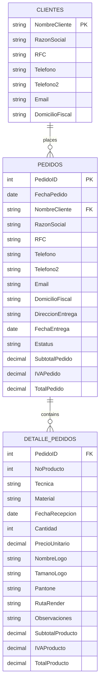

# 🧾 VBA Client & Order Management System

Sistema de gestión de clientes y pedidos desarrollado en **Excel VBA**, diseñado para automatizar procesos administrativos como el registro, actualización y consulta de información.

---

## 🎬 System Demo

This video demonstrates the main functionalities of the system:

* User authentication (login)
* Order registration
* Order modification
* Order deletion
* Data validation and structured storage

<video src="docs/system_demo_vba.mp4" controls width="700"></video>

[▶️ Download or watch the video](docs/system_demo_vba.mp4)

---

## 🚀 Features

* 📋 Client registration
* ✏️ Client data update
* 🔍 Search and filtering
* 📦 Order management (CRUD)
* 🧩 Interactive UserForms
* 🗂️ Structured data handling in Excel sheets
* ⚙️ Automation using VBA macros

---

## 🛠️ Technologies Used

* Microsoft Excel (.xlsm)
* VBA (Visual Basic for Applications)

---

## 📁 Project Structure

```
.
├── LICENSE
├── README.md
├── docs/
├── excel/
│   └── Caleido_Pedidos_Database_prefinal.xlsm
└── src/
    ├── classes/
    │   ├── clsDiaCalendario.cls
    │   └── clsEventosProducto.cls
    ├── forms/
    │   ├── Busqueda.frm
    │   ├── Eliminar.frm
    │   ├── Entrada.frm
    │   ├── UserForm1.frm
    │   ├── frmCalendario.frm
    │   └── mostrar_imagen.frm
    └── modules/
        ├── Lammado_de_Formularios.bas
        ├── ModuloCalendario.bas
        ├── ModuloClientes.bas
        ├── ModuloRegModElim.bas
        ├── ModuloValidaciones.bas
        └── ped_id_creator.bas
```

---

## 🧠 Architecture

The system follows a modular design:

* **Modules** → Core business logic
* **UserForms** → User interface
* **Classes** → Entity handling (clients, orders, products)

### 🔄 Workflow

User → Form → Validation → Data storage (Excel sheets) → Confirmation

This separation improves maintainability and scalability.

---

## ⚙️ Installation & Usage

### Prerequisites

* Microsoft Excel (2010 or later recommended)
* Macros enabled

### Installation

```bash
git clone https://github.com/alienfibio-25/vba_client_order_management_system_beta.git
cd vba_client_order_management_system_beta
```

### Run

1. Go to `excel/`
2. Open `Caleido_Pedidos_Database_prefinal.xlsm`
3. Enable macros when prompted

---

## ⚠️ Macro Security Notice

This project uses VBA macros.

If macros are blocked:

1. Right-click the `.xlsm` file
2. Go to **Properties**
3. Check **Unblock**
4. Enable macros when opening in Excel

Alternatively, move the file to a trusted location in Excel settings.

---

## 📊 Entity Relationship Diagram



## 🤝 Contributing

Contributions are welcome:

1. Fork the repository
2. Create a branch (`feature/your-feature`)
3. Commit changes
4. Push and open a Pull Request

---

## 📄 License

This project is licensed under the MIT License.

---

## 📞 Contact

* Author: [Pablo A. V. Calva](https://github.com/alienfibio-25)
* Project: [GitHub Repository](https://github.com/alienfibio-25/vba_client_order_management_system_beta)
